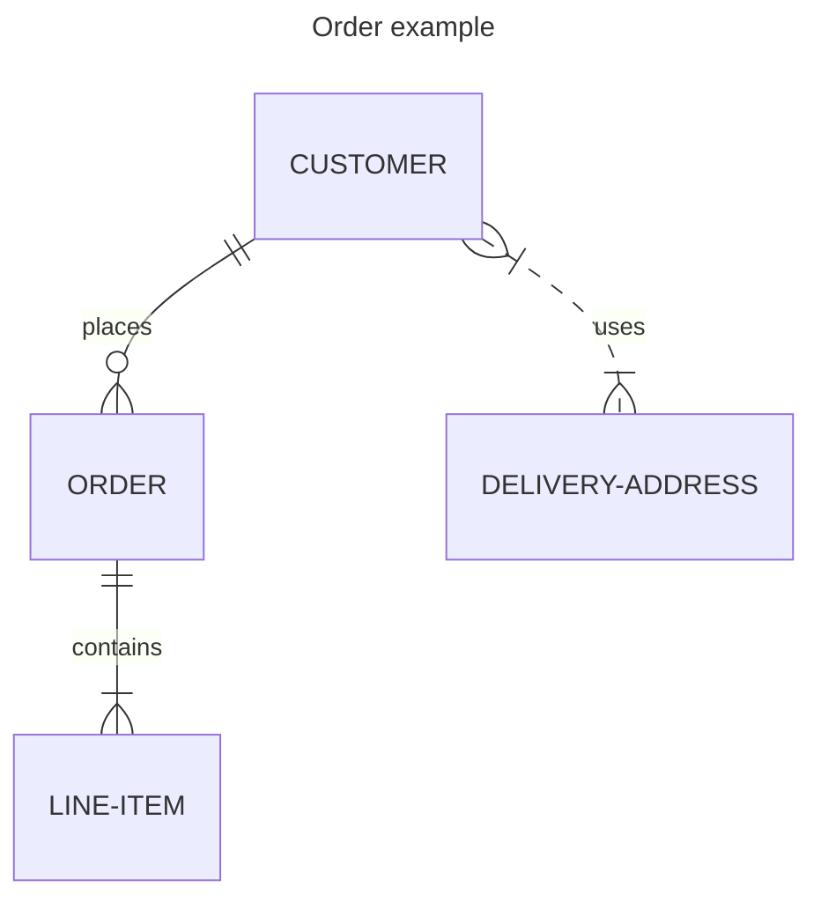
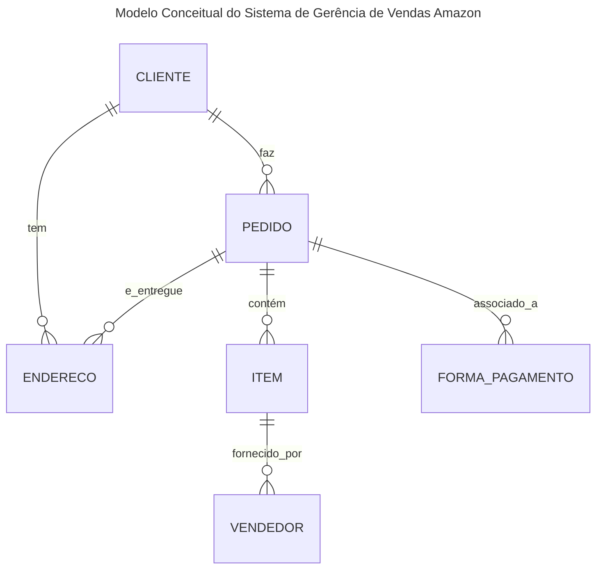
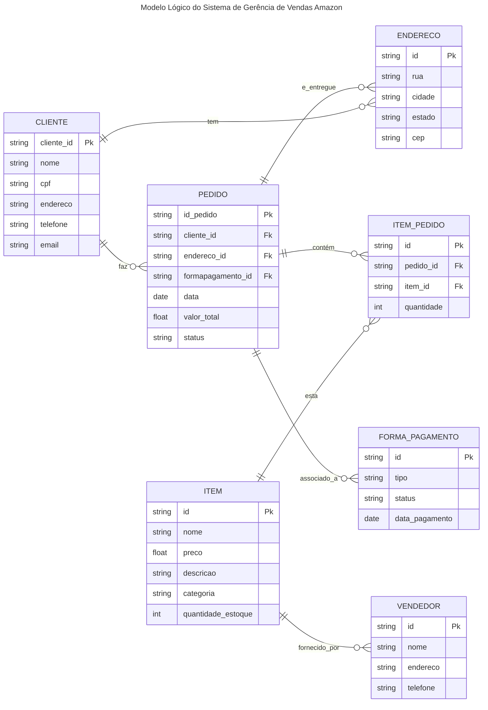

# Entendendo e Modelando Dados

Todos sistemas de informação são construídos sobre dados. Esses dados podem ser armazenados em diferentes formatos, como arquivos de texto, planilhas, bancos de dados relacionais ou não relacionais, entre outros. A forma como os dados são organizados e estruturados é fundamental para o sucesso de qualquer sistema.

Todos os domínios de aplicação (ex. saúde, finanças, logística, etc.) têm suas próprias características e requisitos específicos. Portanto, é importante entender o domínio de aplicação antes de começar a modelar os dados. Isso envolve a identificação dos principais conceitos, entidades e relacionamentos que existem no domínio.

Entender os dados é o primeiro passo para modelá-los. Isso envolve a coleta de dados, a análise de sua estrutura e a identificação de padrões e tendências. O objetivo é entender como os dados se relacionam entre si e como podem ser usados para atender às necessidades do sistema.

Vamos imaginar o sistema de gerência de vendas da Amazon. Existem varias informações que podem ser coletadas, como:
- Informações sobre os produtos (nome, preço, descrição, etc.)
- Informações sobre os clientes (nome, endereço, telefone, etc.)
- Informações sobre os pedidos (data, produtos comprados, valor total, etc.)
- Informações sobre os pagamentos (forma de pagamento, status, etc.)
- Informações sobre os envios (transportadora, data de envio, status, etc.)
- Informações sobre os retornos (motivo, status, etc.)
- Informações sobre os fornecedores (nome, endereço, telefone, etc.)
- Informações sobre os estoques (quantidade disponível, localização, etc.)
- Informações sobre as promoções (desconto, validade, etc.)
- Informações sobre os relatórios (vendas, estoque, etc.)

Essas são apenas possibilidades de informações que podem ser coletadas. O importante é entender quais informações são relevantes para o sistema e como elas se relacionam entre si. Isso envolve a identificação de entidades (ex. produtos, clientes, pedidos, etc.) e seus atributos (ex. nome, preço, descrição, etc.), bem como os relacionamentos entre essas entidades (ex. um cliente pode fazer vários pedidos, um pedido pode conter vários produtos, etc.). Essa análise é fundamental para a modelagem dos dados.

## Modelagem de Dados

A modelagem de dados é o processo de criar uma representação abstrata dos dados que serão armazenados em um sistema. Essa representação pode ser feita de várias formas, como diagramas, tabelas ou esquemas. O objetivo da modelagem de dados é criar uma estrutura que permita armazenar, recuperar e manipular os dados de forma eficiente e eficaz.
A modelagem de dados envolve a identificação das entidades, atributos e relacionamentos que existem no domínio de aplicação. Isso pode ser feito por meio de técnicas como entrevistas com usuários, análise de documentos e observação do sistema em funcionamento. Uma vez que as entidades, atributos e relacionamentos foram identificados, é possível criar um modelo de dados que represente essas informações de forma clara e concisa. 

Esse modelo pode ser usado como base para a criação do banco de dados e para o desenvolvimento do sistema.

## Modelagem Conceitual

Vamos considerar o exemplo do sistema de gerência de vendas da Amazon. Para modelar os dados desse sistema, podemos começar criando um modelo conceitual. Esse modelo é uma representação abstrata dos dados que serão armazenados no sistema e deve incluir as entidades, atributos e relacionamentos identificados na análise do domínio.

O modelo conceitual pode ser representado por meio de um diagrama, que mostra as entidades e seus relacionamentos. 


### Possíveis Entidades e Atributos

#### Produto / Item
- **ID do Produto** (chave primária)
- Nome
- Preço
- Descrição
- Categoria
- Quantidade em Estoque

#### Cliente
- **ID do Cliente** (chave primária)
- Nome
- Endereço
- Telefone
- E-mail

#### Pedido
- **ID do Pedido** (chave primária)
- Data do Pedido
- Valor Total
- Status

#### Pagamento
- **ID do Pagamento** (chave primária)
- Forma de Pagamento
- Status do Pagamento
- Data do Pagamento

#### Envio
- **ID do Envio** (chave primária)
- Transportadora
- Data de Envio
- Status do Envio

#### Retorno
- **ID do Retorno** (chave primária)
- Motivo
- Status do Retorno
- Data do Retorno

### Fornecedor
- **ID do Fornecedor** (chave primária)
- Nome
- Endereço
- Telefone

#### Estoque
- **ID do Estoque** (chave primária)
- Localização
- Quantidade Disponível

#### Promoção
- **ID da Promoção** (chave primária)
- Desconto
- Validade

#### Relatório
- **ID do Relatório** (chave primária)
- Tipo de Relatório (vendas, estoque, etc.)
- Data de Geração

#### Possíveis Relacionamentos

- Um **Cliente** pode fazer vários **Pedidos**.
- Um **Pedido** pode conter vários **Produtos**.
- Um **Produto** pode ser fornecido por vários **Fornecedores**.
- Um **Pedido** está associado a um **Pagamento**.
- Um **Pedido** pode ter um **Envio**.
- Um **Pedido** pode gerar um **Retorno**.
- Um **Produto** pode estar associado a uma **Promoção**.
- Um **Estoque** armazena vários **Produtos**.
- Um **Relatório** pode ser gerado para diferentes entidades (ex.: vendas, estoque).


## Diagrama Conceitual

A representação do modelo conceitual pode ser feita por meio de um diagrama ER (Entidade-Relacionamento). Esse diagrama mostra as entidades e os relacionamentos entre elas. O diagrama ER é uma ferramenta importante para visualizar a estrutura dos dados e entender como eles se relacionam.






Uma vez que o modelo conceitual foi criado, podemos passar para a modelagem lógica. Essa etapa envolve a criação de um modelo mais detalhado, que inclui as tabelas, colunas e relacionamentos que serão usados no banco de dados. O modelo lógico deve ser baseado no modelo conceitual, mas deve incluir detalhes adicionais, como tipos de dados e restrições.




A partir do modelo lógico, podemos criar o banco de dados e as tabelas necessárias para armazenar os dados. Isso envolve a definição das tabelas, colunas, tipos de dados e restrições que serão usadas no banco de dados. O modelo lógico deve ser usado como base para a criação do banco de dados e para o desenvolvimento do sistema.

## Modelagem Física

A modelagem física é a etapa final do processo de modelagem de dados. Nessa etapa, o modelo lógico é convertido em um modelo físico, que inclui detalhes específicos sobre como os dados serão armazenados no banco de dados. Isso envolve a definição das tabelas, colunas, tipos de dados e restrições que serão usadas no banco de dados.

A modelagem física deve levar em consideração fatores como desempenho, escalabilidade e segurança. É importante escolher os tipos de dados corretos para cada coluna, definir as chaves primárias e estrangeiras corretamente e aplicar as restrições necessárias para garantir a integridade dos dados.

Além disso, a modelagem física deve considerar o ambiente em que o banco de dados será executado. Isso inclui fatores como o sistema operacional, o hardware e o software de banco de dados que serão usados. É importante escolher as opções corretas para garantir que o banco de dados funcione corretamente e atenda às necessidades do sistema.

A modelagem fisica depende do SGBD (Sistema de Gerenciamento de Banco de Dados) que será utilizado. Cada SGBD tem suas próprias características e limitações, e é importante escolher o SGBD correto para atender às necessidades do sistema. Além disso, a modelagem física deve considerar fatores como desempenho, escalabilidade e segurança.

No nosso curso iremos utilizar o PostgreSQL como SGBD. O PostgreSQL é um sistema de gerenciamento de banco de dados relacional de código aberto, que é amplamente utilizado em aplicações empresariais e acadêmicas. Ele oferece uma ampla gama de recursos e funcionalidades, incluindo suporte a transações, integridade referencial, segurança e escalabilidade.

## SQL - Postgres

O SQL (Structured Query Language) é a linguagem padrão para interagir com bancos de dados relacionais. O PostgreSQL é um sistema de gerenciamento de banco de dados relacional que utiliza o SQL como sua linguagem principal. O SQL é usado para criar, modificar e consultar bancos de dados, tabelas e outros objetos.

O SQL é uma linguagem declarativa, o que significa que você descreve o que deseja fazer, e o sistema de banco de dados cuida de como fazer isso. Isso torna o SQL uma linguagem poderosa e flexível para trabalhar com dados.

O SQL é dividido em várias categorias, incluindo:
- **DDL (Data Definition Language)**: usado para definir a estrutura do banco de dados, incluindo tabelas, colunas e restrições. Exemplos de comandos DDL incluem `CREATE`, `ALTER` e `DROP`.

- **DML (Data Manipulation Language)**: usado para manipular os dados no banco de dados, incluindo inserção, atualização e exclusão de dados. Exemplos de comandos DML incluem `INSERT`, `UPDATE` e `DELETE`.

- **DQL (Data Query Language)**: usado para consultar os dados no banco de dados. O comando mais comum na DQL é o `SELECT`, que é usado para recuperar dados de uma ou mais tabelas.

Consederando o modelo conceitual e lógico que criamos, podemos criar as tabelas no banco de dados PostgreSQL. Abaixo estão os comandos SQL para criar as tabelas do sistema de gerência de vendas da Amazon:

```sql
CREATE TABLE cliente (
    cliente_id SERIAL PRIMARY KEY,
    nome VARCHAR(100) NOT NULL,
    cpf VARCHAR(11) NOT NULL UNIQUE,
    endereco VARCHAR(255),
    telefone VARCHAR(15),
    email VARCHAR(100)
);
CREATE TABLE endereco (
    endereco_id SERIAL PRIMARY KEY,
    rua VARCHAR(255) NOT NULL,
    cidade VARCHAR(100) NOT NULL,
    estado VARCHAR(50) NOT NULL,
    cep VARCHAR(10) NOT NULL
);
CREATE TABLE forma_pagamento (
    forma_pagamento_id SERIAL PRIMARY KEY,
    tipo VARCHAR(50) NOT NULL,
    status VARCHAR(50) NOT NULL,
    data_pagamento DATE NOT NULL
);
CREATE TABLE vendedor (
    vendedor_id SERIAL PRIMARY KEY,
    nome VARCHAR(100) NOT NULL,
    endereco VARCHAR(255),
    telefone VARCHAR(15)
);
CREATE TABLE item (
    item_id SERIAL PRIMARY KEY,
    nome VARCHAR(100) NOT NULL,
    preco DECIMAL(10, 2) NOT NULL,
    descricao TEXT,
    categoria VARCHAR(50),
    quantidade_estoque INT NOT NULL
);
CREATE TABLE pedido (
    pedido_id SERIAL PRIMARY KEY,
    cliente_id INT REFERENCES cliente(cliente_id),
    endereco_id INT REFERENCES endereco(endereco_id),
    forma_pagamento_id INT REFERENCES forma_pagamento(forma_pagamento_id),
    data DATE NOT NULL,
    valor_total DECIMAL(10, 2) NOT NULL,
    status VARCHAR(50) NOT NULL
);
CREATE TABLE item_pedido (
    item_pedido_id SERIAL PRIMARY KEY,
    pedido_id INT REFERENCES pedido(pedido_id),
    item_id INT REFERENCES item(item_id),
    quantidade INT NOT NULL
);
```

## Conclusão

A modelagem de dados é uma etapa fundamental no desenvolvimento de sistemas de informação. Ela envolve a identificação das entidades, atributos e relacionamentos que existem no domínio de aplicação, bem como a criação de um modelo conceitual, lógico e físico que represente essas informações. A modelagem de dados deve levar em consideração fatores como desempenho, escalabilidade e segurança, e deve ser baseada nas necessidades do sistema e no ambiente em que o banco de dados será executado.

A modelagem de dados é um processo iterativo e pode ser ajustada conforme o sistema evolui. É importante revisar e atualizar o modelo de dados regularmente para garantir que ele atenda às necessidades do sistema e dos usuários.

A modelagem de dados é uma habilidade essencial para qualquer profissional que trabalhe com dados, e é fundamental para o sucesso de qualquer sistema de informação. Ao entender e modelar os dados corretamente, é possível criar sistemas mais eficientes, escaláveis e seguros.

## Referências

- Elmasri, R., & Navathe, S. B. (2015). Fundamentals of Database Systems (7th ed.). Pearson.

- Date, C. J. (2004). An Introduction to Database Systems (8th ed.). Addison-Wesley.

- Connolly, T., & Begg, C. (2015). Database Systems: A Practical Approach to Design, Implementation, and Management (6th ed.). Pearson.