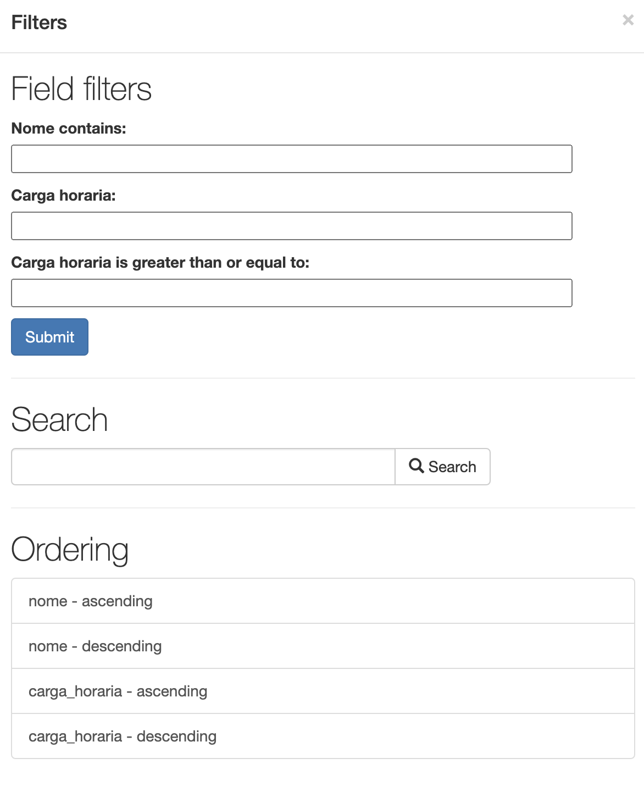

# Filtragem de Dados em Django Rest Framework

A filtragem de dados é importante para recuperar informações específicas de um conjunto de dados. A filtragem de dados é usada para recuperar informações de um banco de dados que atendam a um critério específico. 

Em Django Rest Framework, a filtragem de dados é feita usando um conjunto de classes de filtragem.

```bash
pip install django-filter

```

## Configurações do Projeto

No arquivo `settings.py`, adicione no `INSTALLED_APPS`:

```python
INSTALLED_APPS = [
    # ...
    'rest_framework',
    'django_filters',
]
```

Configure o `REST_FRAMEWORK` para usar o `django-filter` como backend padrão:
Logo após a definição do `REST_FRAMEWORK`, adicione o seguinte código:

```python
REST_FRAMEWORK = {
    'DEFAULT_FILTER_BACKENDS': [
        'django_filters.rest_framework.DjangoFilterBackend',
        'rest_framework.filters.SearchFilter',  # Filtro de busca
        'rest_framework.filters.OrderingFilter',  # Filtro de ordenação
    ],
}
```

Tanto os modelos quanto os serializers não necessitam de ajuste específico para permitir permitir a filtragem de dados.
O que precisa ser feito é criar classe de filtragem para o modelo que deseja-se filtrar. Os filtros personalizados são criados em um arquivo separado chamado `filters.py`.

```python
import django_filters
from .models import *

class DisciplinaFilter(django_filters.FilterSet):
    nome = django_filters.CharFilter(lookup_expr='icontains')  # Busca parcial (case-insensitive)
    carga_horaria_min = django_filters.NumberFilter(field_name='carga_horaria', lookup_expr='gte')

    class Meta:
        model = Disciplina
        fields = ['nome', 'carga_horaria']  # Campos para filtragem exata

class AlunoFilter(django_filters.FilterSet):
    nome = django_filters.CharFilter(lookup_expr='icontains')  # Busca parcial (case-insensitive)

```

No código acima criamos 2 classes para filtros persolalizados para os modelos `Disciplina` e `Aluno`. A classe `DisciplinaFilter` contém 2 filtros personalizados: um filtro de busca parcial e um filtro de busca exata. O filtro de busca parcial é usado para recuperar disciplinas cujo nome contém uma string específica. O filtro de busca exata é usado para recuperar disciplinas cuja carga horária é maior ou igual a um valor específico.

A classe `AlunoFilter` contém um filtro personalizado para busca parcial. O filtro de busca parcial é usado para recuperar alunos cujo nome contém uma string específica.

Em `views.py`, é necessário criar uma `view` que utilize os filtros. É possível usar tanto `APIView` ou `ViewSet`.


```python
class DisciplinaViewSet(viewsets.ModelViewSet):
    queryset = Disciplina.objects.all()
    serializer_class = DisciplinaSerializer 
    filterset_class = DisciplinaFilter  # Usando o filtro personalizado
    search_fields = ['nome', 'carga_horaria']  # Campos para busca (SearchFilter)
    ordering_fields = ['nome', 'carga_horaria']  # Campos para ordenação (OrderingFilter)

class AlunoViewSet(viewsets.ModelViewSet):
    queryset = Aluno.objects.all()
    serializer_class = AlunoSerializer
    filterset_class = AlunoFilter  # Usando o filtro personalizado
    search_fields = ['nome']  # Campos para busca (SearchFilter)
    ordering_fields = ['nome']  # Campos para ordenação (OrderingFilter)
```

Para configurar o endpoint de acesso a essas funcionalidades, é necessário adicionar as rotas no arquivo `urls.py`.

```python
from api.views import * # type: ignore

router = DefaultRouter()
router.register(r'alunos', views.AlunoViewSet)
router.register(r'disciplinas', views.DisciplinaViewSet)

```

Acesse a URL `http://localhost:8000/api/disciplinas/` e use parâmetros de query para filtrar.

No exemplo abaixo, é possível ver a filtragem de disciplinas cujo nome contém a string `matematica` e cuja carga horária é maior ou igual a 60 horas.

```bash
http://localhost:8000/api/disciplinas/?nome__icontains=matematica&carga_horaria_min=60
```

Ao utilizar o acesso direto a `http://localhost:8000/api/disciplinas/`há uma opção específica para filtragem.



Os componentes de filtragem são gerados automaticamente com base nos campos definidos em `DisciplinaFilter`.

- `django-filter`: Permite criar filtros complexos com expressões como `icontains, gte, lte, etc`.

- `SearchFilter`: Busca em múltiplos campos definidos em `search_fields`.

`OrderingFilter`: Ordena os resultados com base nos campos definidos em `ordering_fields`.

## Conclusão

Neste aula, aprendemos a filtrar dados em Django Rest Framework usando `django-filter`. Criamos filtros personalizados para os modelos `Disciplina` e `Aluno` e configuramos a filtragem de dados em `DisciplinaViewSet` e `AlunoViewSet`. Também aprendemos a usar `SearchFilter` e `OrderingFilter` para buscar e ordenar dados.

## Referências

- [Django Rest Framework - Filtering](https://www.django-rest-framework.org/api-guide/filtering/)

- [Django Rest Framework - SearchFilter](https://www.django-rest-framework.org/api-guide/filtering/#searchfilter)

- [Django Rest Framework - OrderingFilter](https://www.django-rest-framework.org/api-guide/filtering/#orderingfilter)