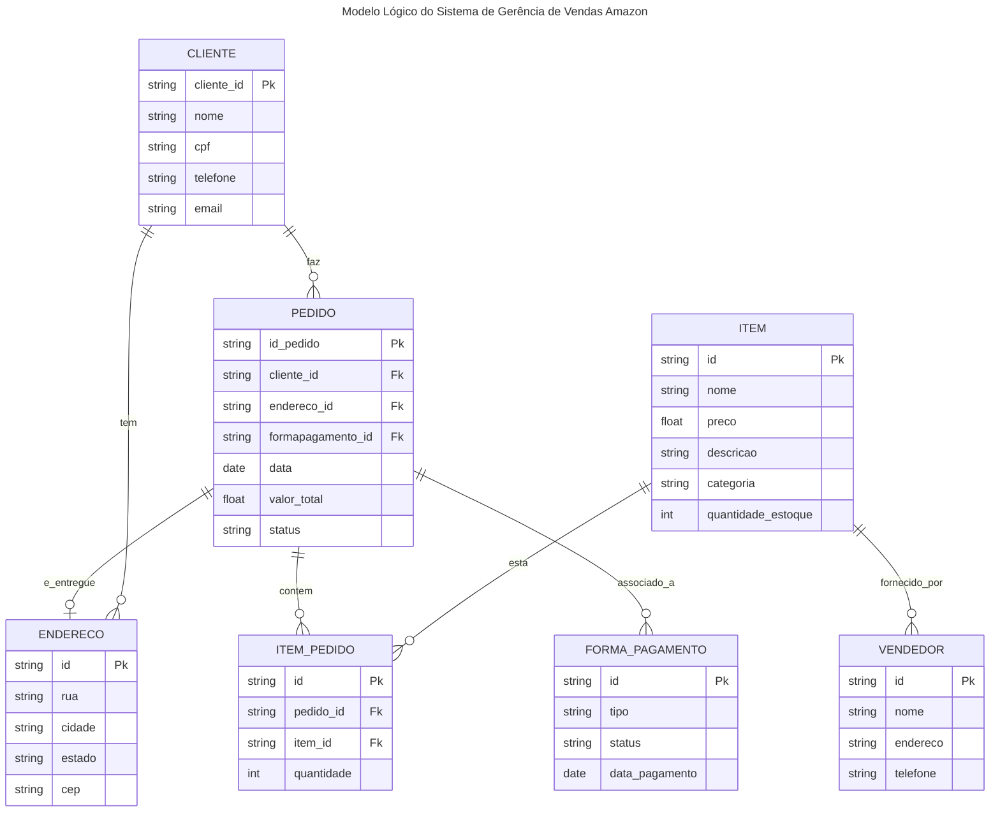

# Manpulando Dados em um SGBD Relacional

## Introdução

Aula passada vimos a introdução ao banco de dados, o que é um SGBD e os tipos de SGBDs. Nesta aula, vamos nos aprofundar na manipulação de dados. COnsideraremos o sistema de gerência de vendas da Amazon como exemplo. Vamos explorar o modelo de dados, a modelagem conceitual, lógica e física, e como criar tabelas no PostgreSQL.

O modelo conceitual e lógico vista na última aula considerou um sistema de gerência de vendas da Amazon. O modelo conceitual é uma representação abstrata do sistema, que descreve as entidades, atributos e relacionamentos que existem no domínio de aplicação. O modelo conceitual deve ser independente de qualquer implementação específica e deve ser baseado nas necessidades do sistema.

#### Diagrama Conceitual


#### Modelagem Lógica



#### Modelagem Física

```sql
CREATE TABLE cliente (
    cliente_id SERIAL PRIMARY KEY,
    nome VARCHAR(100) NOT NULL,
    cpf VARCHAR(11) NOT NULL UNIQUE,  
    telefone VARCHAR(15),
    email VARCHAR(100)
);
CREATE TABLE endereco (
    endereco_id SERIAL PRIMARY KEY,
    cliente_id INT REFERENCES cliente(cliente_id),
    rua VARCHAR(255) NOT NULL,
    cidade VARCHAR(100) NOT NULL,
    estado VARCHAR(50) NOT NULL,
    cep VARCHAR(10) NOT NULL
);
CREATE TABLE forma_pagamento (
    forma_pagamento_id SERIAL PRIMARY KEY,
    tipo VARCHAR(50) NOT NULL,  
);
CREATE TABLE vendedor (
    vendedor_id SERIAL PRIMARY KEY,
    nome VARCHAR(100) NOT NULL,
    endereco VARCHAR(255),
    telefone VARCHAR(15)
);
CREATE TABLE item (
    item_id SERIAL PRIMARY KEY,
    nome VARCHAR(100) NOT NULL,
    preco DECIMAL(10, 2) NOT NULL,
    descricao TEXT,
    categoria VARCHAR(50),
    quantidade_estoque INT NOT NULL
);
CREATE TABLE pedido (
    pedido_id SERIAL PRIMARY KEY,
    cliente_id INT REFERENCES cliente(cliente_id),
    endereco_id INT REFERENCES endereco(endereco_id),
    forma_pagamento_id INT REFERENCES forma_pagamento(forma_pagamento_id),
    data DATE NOT NULL,
    valor_total DECIMAL(10, 2) NOT NULL,
    status VARCHAR(50) NOT NULL
);
CREATE TABLE item_pedido (
    item_pedido_id SERIAL PRIMARY KEY,
    pedido_id INT REFERENCES pedido(pedido_id),
    item_id INT REFERENCES item(item_id),
    quantidade INT NOT NULL
);
```

## Inserindo Dados

Para inserir dados em uma tabela no PostgreSQL, utilizamos o comando `INSERT INTO`. A sintaxe básica é a seguinte:

```sql
INSERT INTO nome_tabela (coluna1, coluna2, ...)
VALUES (valor1, valor2, ...);
```

### Exemplo de Dados de Clientes

Vamos inserir alguns dados nas tabelas que criamos. Vamos começar com a tabela `cliente`:

```sql
INSERT INTO cliente (nome, cpf, telefone, email) VALUES
('Ana Silva', '12345678901', '11987654321', 'ana.silva@example.com'),
('Carlos Oliveira', '23456789012', '21987654321', 'carlos.oliveira@example.com'),
('Mariana Costa', '34567890123', '31987654321', 'mariana.costa@example.com'),
('João Souza', '45678901234', '41987654321', 'joao.souza@example.com'),
('Fernanda Lima', '56789012345', '51987654321', 'fernanda.lima@example.com'),
('Pedro Santos', '67890123456', '71987654321', 'pedro.santos@example.com'),
('Juliana Almeida', '78901234567', '81987654321', 'juliana.almeida@example.com'),
('Rafael Pereira', '89012345678', '91987654321', 'rafael.pereira@example.com'),
('Beatriz Rocha', '90123456789', '61987654321', 'beatriz.rocha@example.com'),
('Lucas Martins', '01234567890', '71987654322', 'lucas.martins@example.com'),
('Gabriela Mendes', '11234567891', '81987654322', 'gabriela.mendes@example.com'),
('Rodrigo Araujo', '21234567892', '91987654322', 'rodrigo.araujo@example.com'),
('Camila Ribeiro', '31234567893', '61987654322', 'camila.ribeiro@example.com'),
('Thiago Fernandes', '41234567894', '71987654323', 'thiago.fernandes@example.com'),
('Larissa Carvalho', '51234567895', '81987654323', 'larissa.carvalho@example.com');
```

Esses dados podem ser usados para testar consultas SQL, como:

- Buscar clientes cujo nome contém "Silva":

  ```sql
  SELECT * FROM cliente WHERE nome LIKE '%Silva%';
  ```
- Buscar clientes com CPF começando com "123":

  ```sql
  SELECT * FROM cliente WHERE cpf LIKE '123%';
  ```
- Buscar clientes com telefone terminando em "54321":

  ```sql
  SELECT * FROM cliente WHERE telefone LIKE '%54321%';
  ```

### Exemplo de Dados de Endereço

Agora vamos inserir alguns dados na tabela `endereco`:

```sql
INSERT INTO endereco (rua, cidade, estado, cep) VALUES
('Rua das Flores, 23', 'Natal', 'RN', '59010-000'),
('Avenida Prudente de Morais, 553', 'Natal', 'RN', '59020-000'),
('Rua Jaguarari, 234', 'Natal', 'RN', '59030-000'),
('Avenida Hermes da Fonseca, 5', 'Natal', 'RN', '59040-000'),
('Rua São José, 435', 'Natal', 'RN', '59050-000'),
('Avenida Roberto Freire, 541', 'Natal', 'RN', '59060-000'),
('Rua Mossoró, 90', 'Natal', 'RN', '59070-000'),
('Avenida Engenheiro Roberto Freire, 32', 'Natal', 'RN', '59080-000'),
('Rua João Pessoa, 434', 'Natal', 'RN', '59090-000'),
('Avenida Rio Branco, 6789', 'Natal', 'RN', '59100-000'),
('Rua Coronel Estevam, 3423', 'Natal', 'RN', '59110-000'),
('Avenida Salgado Filho, 2344', 'Natal', 'RN', '59120-000'),
('Rua Felipe Camarão, 2', 'Natal', 'RN', '59130-000'),
('Avenida Alexandrino de Alencar, 43', 'Natal', 'RN', '59140-000'),
('Rua Doutor Barata, 8090', 'Natal', 'RN', '59150-000');
```

Esses endereços podem ser usados para testar consultas SQL, como:

- Buscar endereços na cidade de Natal:

  ```sql
  SELECT * FROM endereco WHERE cidade = 'Natal';
  ```
- Buscar endereços cujo CEP começa com "5901":

  ```sql
  SELECT * FROM endereco WHERE cep LIKE '5901%';
  ```
- Buscar endereços na Avenida Roberto Freire:

  ```sql
  SELECT * FROM endereco WHERE rua LIKE '%Roberto Freire%';
  ```

### Exemplo de Dados de Vendedores

Vamos inserir alguns dados na tabela `vendedor`:

```sql
INSERT INTO vendedor (nome, endereco, telefone) VALUES
('Loja A', 'Rua das Flores, 123', '84987654321'),
('Loja B', 'Avenida Prudente de Morais, 456', '84987654322'),
('Loja C', 'Rua Jaguarari, 789', '84987654323'),
('Loja D', 'Avenida Hermes da Fonseca, 101', '84987654324'),
('Loja E', 'Rua São José, 202', '84987654325');
```

Esses vendedores podem ser usados para testar consultas SQL, como:

- Buscar vendedores cujo nome contém "Loja":

  ```sql
  SELECT * FROM vendedor WHERE nome LIKE '%Loja%';
  ```
- Buscar vendedores com telefone terminando em "54321":

  ```sql
  SELECT * FROM vendedor WHERE telefone LIKE '%54321%';
  ```
- Buscar vendedores na Rua das Flores:

  ```sql
  SELECT * FROM vendedor WHERE endereco LIKE '%Rua das Flores%';
  ```

### Exemplo de Dados de Itens

Agora vamos inserir alguns dados na tabela `item`:

```sql
INSERT INTO item (nome, preco, descricao, categoria, quantidade_estoque) VALUES
-- Livros
('O Poder do Hábito', 39.90, 'Livro sobre hábitos e mudanças comportamentais', 'Livros', 50),
('1984', 29.90, 'Clássico da literatura distópica de George Orwell', 'Livros', 30),
('Sapiens: Uma Breve História da Humanidade', 49.90, 'Livro sobre a história da humanidade', 'Livros', 40),
('A Revolução dos Bichos', 19.90, 'Fábula política de George Orwell', 'Livros', 25),
('O Pequeno Príncipe', 24.90, 'Clássico da literatura infantil', 'Livros', 60),
('Dom Casmurro', 14.90, 'Obra de Machado de Assis', 'Livros', 35),
('Harry Potter e a Pedra Filosofal', 34.90, 'Primeiro livro da série Harry Potter', 'Livros', 45),
('O Senhor dos Anéis: A Sociedade do Anel', 59.90, 'Primeiro livro da trilogia O Senhor dos Anéis', 'Livros', 20),
('A Arte da Guerra', 19.90, 'Clássico sobre estratégia militar', 'Livros', 50),
('O Alquimista', 29.90, 'Livro de Paulo Coelho sobre autodescoberta', 'Livros', 40),

-- Eletrônicos
('Fone de Ouvido Bluetooth JBL', 199.90, 'Fone de ouvido sem fio com alta qualidade de som', 'Eletrônicos', 15),
('Smartphone Samsung Galaxy S21', 3999.90, 'Smartphone com câmera de alta resolução', 'Eletrônicos', 10),
('Notebook Dell Inspiron 15', 3499.90, 'Notebook com processador Intel Core i5', 'Eletrônicos', 8),
('Smart TV LG 50"', 2499.90, 'Smart TV 4K com 50 polegadas', 'Eletrônicos', 5),
('Caixa de Som Bluetooth JBL', 299.90, 'Caixa de som portátil com som potente', 'Eletrônicos', 20),
('Relógio Smartwatch Xiaomi', 349.90, 'Relógio inteligente com monitoramento de saúde', 'Eletrônicos', 25),
('Câmera GoPro HERO9', 2499.90, 'Câmera de ação com resolução 5K', 'Eletrônicos', 12),
('Teclado Mecânico Gamer', 399.90, 'Teclado mecânico com iluminação RGB', 'Eletrônicos', 30),
('Monitor LED 24" Samsung', 899.90, 'Monitor Full HD com 24 polegadas', 'Eletrônicos', 18),
('Carregador Portátil 20.000mAh', 149.90, 'Power bank de alta capacidade', 'Eletrônicos', 50),

-- Acessórios
('Mochila para Notebook', 129.90, 'Mochila resistente para notebooks de até 15.6"', 'Acessórios', 40),
('Capa para Smartphone', 49.90, 'Capa protetora para smartphones', 'Acessórios', 60),
('Mouse Pad Gamer', 39.90, 'Mouse pad com superfície antiderrapante', 'Acessórios', 50),
('Fone de Ouvido Intra-Auricular', 59.90, 'Fone de ouvido com isolamento de ruído', 'Acessórios', 30),
('Carregador Veicular USB', 29.90, 'Carregador para automóveis com duas portas USB', 'Acessórios', 70),
('Suporte para Celular', 19.90, 'Suporte ajustável para smartphones', 'Acessórios', 80),
('Bolsa Térmica', 89.90, 'Bolsa térmica para alimentos e bebidas', 'Acessórios', 25),
('Relógio de Pulso Masculino', 199.90, 'Relógio analógico resistente à água', 'Acessórios', 20),
('Óculos de Sol UV400', 99.90, 'Óculos de sol com proteção UV', 'Acessórios', 35),
('Cabo HDMI 2.0', 49.90, 'Cabo HDMI de alta velocidade', 'Acessórios', 100),

-- Mais Livros
('O Código Da Vinci', 39.90, 'Livro de Dan Brown sobre mistérios e conspirações', 'Livros', 30),
('A Menina que Roubava Livros', 29.90, 'História emocionante ambientada na Segunda Guerra Mundial', 'Livros', 40),
('O Hobbit', 34.90, 'Livro de J.R.R. Tolkien sobre aventuras na Terra Média', 'Livros', 25),
('Cem Anos de Solidão', 49.90, 'Obra-prima de Gabriel García Márquez', 'Livros', 20),
('Orgulho e Preconceito', 19.90, 'Clássico de Jane Austen', 'Livros', 50),

-- Mais Eletrônicos
('Headset Gamer HyperX', 299.90, 'Headset com som surround 7.1', 'Eletrônicos', 15),
('Kindle Paperwhite', 499.90, 'Leitor de e-books com iluminação ajustável', 'Eletrônicos', 10),
('Placa de Vídeo NVIDIA RTX 3060', 2999.90, 'Placa de vídeo para jogos e edição', 'Eletrônicos', 5),
('Impressora Multifuncional HP', 699.90, 'Impressora com scanner e copiadora', 'Eletrônicos', 12),
('Drone DJI Mini 2', 3999.90, 'Drone compacto com câmera 4K', 'Eletrônicos', 8),

-- Mais Acessórios
('Teclado Bluetooth', 149.90, 'Teclado sem fio compatível com múltiplos dispositivos', 'Acessórios', 25),
('Cadeira Gamer', 899.90, 'Cadeira ergonômica para jogos', 'Acessórios', 10),
('Mala de Viagem', 299.90, 'Mala resistente com rodinhas', 'Acessórios', 15),
('Luminária de Mesa LED', 89.90, 'Luminária com ajuste de intensidade', 'Acessórios', 40),
('Guarda-Chuva Automático', 59.90, 'Guarda-chuva compacto e resistente', 'Acessórios', 50);
```

Esses itens podem ser usados para testar consultas SQL, como:

- Buscar itens da categoria "Livros":

  ```sql
  SELECT * FROM item WHERE categoria = 'Livros';
  ```
- Buscar itens com preço maior que 100:

  ```sql
  SELECT * FROM item WHERE preco > 100;
  ```
- Buscar itens cujo nome contém "Smart":

  ```sql
  SELECT * FROM item WHERE nome LIKE '%Smart%';
  ```

### Exemplo de Dados de Forma de Pagamento

Agora vamos inserir alguns dados na tabela `forma_pagamento`:

```sql
INSERT INTO forma_pagamento (tipo) VALUES
('Cartão de Crédito'),
('Boleto Bancário'),
('Transferência Bancária'),
('Pix'),
('Cartão de Débito'),
('PayPal'),
('Cartão de Presente'), 
('Criptomoeda'),
('Vale-Alimentação'),
('Cheque');
```

Essas formas de pagamento podem ser usadas para testar consultas SQL, como:

- Buscar formas de pagamento cujo tipo contém "Cartão":

  ```sql
  SELECT * FROM forma_pagamento WHERE tipo LIKE '%Cartão%';
  ```
- Buscar formas de pagamento cujo tipo começa com "Transferência":

  ```sql
  SELECT * FROM forma_pagamento WHERE tipo LIKE 'Transferência%';
  ```
- Buscar formas de pagamento cujo tipo termina com "Bancário":

  ```sql
  SELECT * FROM forma_pagamento WHERE tipo LIKE '%Bancário';
  ```

### Exemplo de Dados de Pedidos

Agora vamos inserir alguns dados na tabela `pedido` e `item_pedido`:

```sql
-- Inserindo pedidos
INSERT INTO pedido (cliente_id, endereco_id, forma_pagamento_id, data, valor_total, status) VALUES
(1, 1, 1, '2023-10-01', 259.70, 'Concluído'),
(2, 2, 2, '2023-10-02', 499.80, 'Concluído'),
(3, 3, 3, '2023-10-03', 349.70, 'Pendente'),
(4, 4, 4, '2023-10-04', 699.60, 'Concluído'),
(5, 5, 5, '2023-10-05', 1199.50, 'Cancelado'),
(6, 6, 6, '2023-10-06', 899.70, 'Concluído'),
(7, 7, 7, '2023-10-07', 1499.60, 'Pendente'),
(8, 8, 8, '2023-10-08', 1999.50, 'Concluído'),
(9, 9, 9, '2023-10-09', 2499.40, 'Concluído'),
(10, 10, 10, '2023-10-10', 2999.30, 'Pendente');

-- Inserindo itens nos pedidos
INSERT INTO item_pedido (pedido_id, item_id, quantidade) VALUES
-- Pedido 1
(1, 1, 2),
(1, 2, 1),
(1, 3, 1),
-- Pedido 2
(2, 4, 1),
(2, 5, 2),
(2, 6, 1),
-- Pedido 3
(3, 7, 1),
(3, 8, 1),
(3, 9, 2),
-- Pedido 4
(4, 10, 1),
(4, 11, 1),
(4, 12, 1),
-- Pedido 5
(5, 13, 2),
(5, 14, 1),
(5, 15, 1),
-- Pedido 6
(6, 16, 1),
(6, 17, 1),
(6, 18, 2),
-- Pedido 7
(7, 19, 1),
(7, 20, 1),
(7, 21, 1),
-- Pedido 8
(8, 22, 1),
(8, 23, 2),
(8, 24, 1),
-- Pedido 9
(9, 25, 1),
(9, 26, 1),
(9, 27, 1),
-- Pedido 10
(10, 28, 1),
(10, 29, 1),
(10, 30, 2);
```
Esses pedidos podem ser usados para testar consultas SQL, como:
- Buscar pedidos com status "Concluído":

  ```sql
  SELECT * FROM pedido WHERE status = 'Concluído';
  ```
- Buscar pedidos feitos por um cliente específico:

  ```sql
  SELECT * FROM pedido WHERE cliente_id = 1;
  ```
- Buscar pedidos feitos em uma data específica:

  ```sql
  SELECT * FROM pedido WHERE data = '2023-10-01';
  ```
- Buscar pedidos com valor total maior que 1000:

  ```sql
  SELECT * FROM pedido WHERE valor_total > 1000;
  ```
- Buscar pedidos feitos com a forma de pagamento "Cartão de Crédito":

  ```sql
  SELECT * FROM pedido WHERE forma_pagamento_id = 1;
  ```

## Conclusão

Nesta aula, aprendemos sobre a modelagem de dados e como criar tabelas no PostgreSQL. Também inserimos dados de exemplo nas tabelas e fizemos consultas SQL para testar os dados. Na próxima aula, vamos explorar mais sobre consultas SQL, incluindo junções, agrupamentos e funções de agregação.

## Referências

- [PostgreSQL Documentation](https://www.postgresql.org/docs/)
- [SQL Tutorial](https://www.w3schools.com/sql/)
- [Modelagem de Dados](https://www.devmedia.com.br/modelagem-de-dados/)
- [Banco de Dados Relacional](https://www.devmedia.com.br/banco-de-dados-relacional/)
- [SGBD Relacional](https://www.devmedia.com.br/sgbd-relacional/)