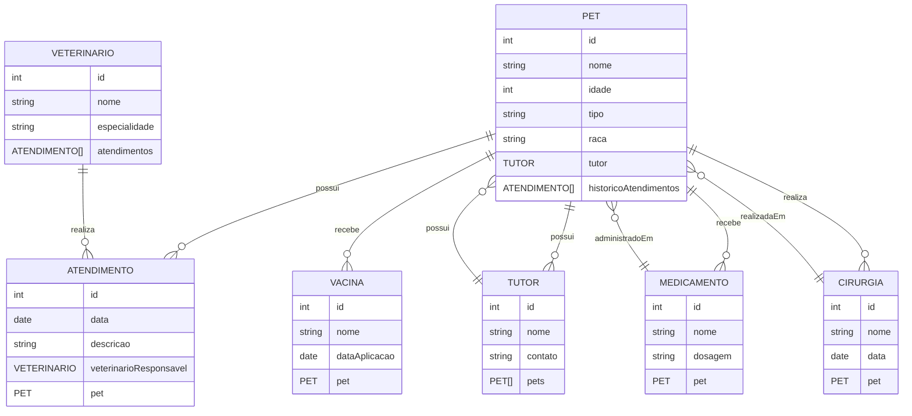

# Seminários 2o Bimestre sobre Desenvolvimento de API Restful com Framework Spring Boot.

## Objetivo

O objetivo deste seminário é proporcionar uma compreensão aprofundada do desenvolvimento de APIs RESTful utilizando o framework Spring Boot. Os grupos aprenderão sobre os princípios fundamentais do design de APIs, as melhores práticas de desenvolvimento e como implementar uma API RESTful completa usando o Spring Boot.

Os temas serão abordados em grupos, cada um focando em um aspecto específico do desenvolvimento de APIs RESTful. Cada grupo terá a responsabilidade de apresentar seu tema e entregar um trabalho prático (TP) relacionado.

## Temas e Cronograma

**1. Configuração Inicial do Projeto Spring Boot + CRUD 1 Classe/Modelo com acesso ao Postgres(JPA)**
Data da apresentação: 08/07
Data do TP: 09/07
Integrantes: Jeremias, Wesley, Marya, Lucas M, Neemias.

**2. Relacionamento e CRUD para todas as classes do Modelo**
Data da apresentação: 15/07
Data do TP: 16/07
Integrantes: Luiz Roberto, Luiz Fernando, Ana Maria, Jesrriel.

**3. Relacionamento e CRUD para todas as classes do Modelo com acesso ao Neo4j para backup de dados**
Data da apresentação: 22/07
Data do TP: 23/07
Integrantes: Mateus, Fábio, Gabrielly, Danilo e Gabrielle.

**4. Gerenciamento de Perfil e autenticação**
Data da apresentação: 29/07
Data do TP: 30/07
Integrantes: Nathan, Lucas P, Maycon, Wilson e Agnes.

**5. Filtragem de dados e consultas avançados com Spring Boot**
Data da apresentação: 05/08
Data do TP: 06/08
Integrantes: Luiz Felipe, Anderson, Giovana, Samuel, Laura.

## Requisitos

Cada grupo deverá descreve (através de uma apresentação) o conteúdo que que ficou responsável, incluindo os seguintes pontos:
- Conceitos básicos do Spring Boot e APIs RESTful.
- Configuração do ambiente de desenvolvimento.
- Implementação de um CRUD básico com uma classe/modelo.
- Implementação de relacionamentos entre classes/modelos.
- Implementação de autenticação e gerenciamento de perfis.
- Implementação de filtragem de dados e consultas avançadas.
- Demonstração de como realizar backup de dados utilizando o Neo4j.

## Entregas
- Cada grupo deverá apresentar um Trabalho Prático - TP, que consiste em desenvolver uma API Restful com acesso a Banco de Dados utilizando o framework apresentado para que os demais alunos possam implementar.
- Cada grupo deverá apresentar um tutorial de como implementar/resolver o TP.
- Cada grupo deverá apresentar as informações, exemplos e TP em Markdown no repositório no GithubClassroom.
- Link do repositório no GithubClassroom: https://classroom.github.com/a/e75b8yIb

## Sistema a ser desenvolvido

O sistema a ser considerado é um sistema para gerenciamento de atendimento de pets em clínicas veterinárias. O sistema deve permitir o cadastro de pets, gerenciamento de histórico de atendimentos e gerenciamento de tutores. Tanto os tutores quanto
os pets devem possuir um perfil, onde o tutor pode gerenciar os dados do pet e o histórico de atendimentos. O sistema deve permitir a autenticação de usuários e a filtragem de dados para consultas avançadas. Os médicos veterinários devem ter acesso ao histórico de atendimentos dos pets e poder registrar novos atendimentos.

O sistema pode também incluir registro de vacinas, medicamentos e cirurgia para cada pet. Os tutores podem verificar o histórico geral de cada um dos seus pets.

### Alguns requisitos funcionais:
- Cadastro de pets com informações básicas (nome, idade, raça, etc.).
- Cadastro de tutores com informações básicas (nome, contato, etc.).
- Autenticação de usuários (tutores e veterinários).
- Vinculação de pets a tutores.
- Gerenciamento de histórico de atendimentos (data, descrição, veterinário responsável, etc.).
- Registro de vacinas, medicamentos e cirurgias.
- Filtragem de dados para consultas avançadas (por exemplo, pets por raça, atendimentos por data, etc.).
- Backup de dados utilizando o Neo4j.
- A lista de requisitos pode ser expandida conforme necessário, dependendo das necessidades do sistema.

### Alguns modelos a serem considerados:
- **Pet**: id, nome, idade, tipo, raça, tutor (referência ao Tutor), histórico de atendimentos (lista de Atendimentos).
- **Tutor**: id, nome, contato, pets (lista de Pets).
- **Atendimento**: id, data, descrição, veterinário responsável (referência ao Veterinário), pet (referência ao Pet).
- **Veterinário**: id, nome, especialidade, atendimentos (lista de Atendimentos).
- **Vacina**: id, nome, data de aplicação, pet (referência ao Pet).
- **Medicamento**: id, nome, dosagem, pet (referência ao Pet).
- **Cirurgia**: id, nome, data, pet (referência ao Pet).  

Veja abaixo o modelo de dados:

