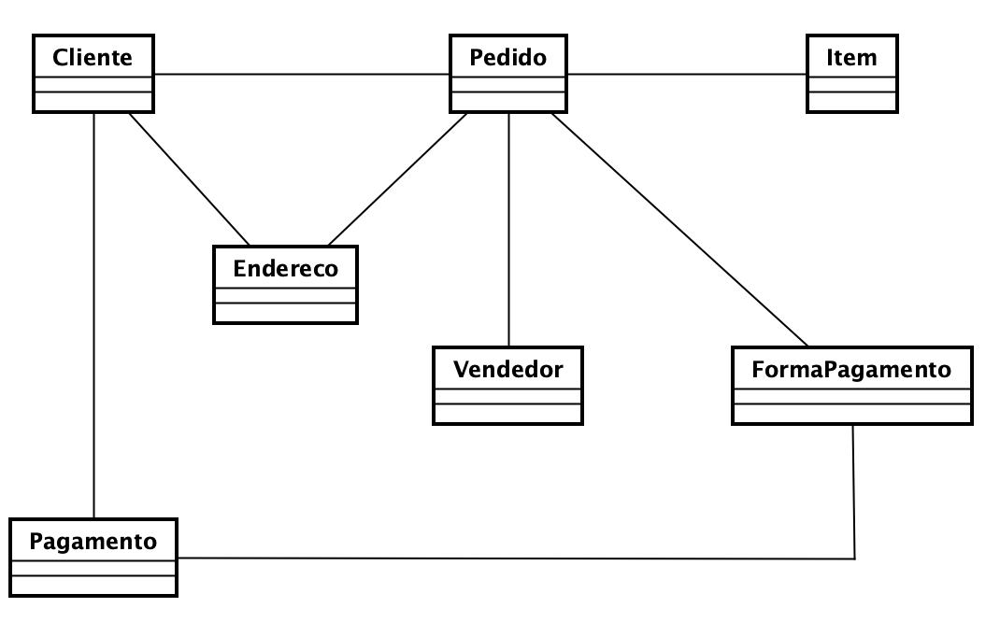

# Modelando Dados

Imagine que você foi contratado para desenvolver um sistema de vendas para uma loja de itens diversos. O sistema deve ser capaz de armazenar informações sobre clientes, vendedores, pedidos, itens, formas de pagamento, endereços de entrega e pagamentos.

Utilize o modelo de dados a seguir para criar as tabelas necessárias para armazenar as informações do sistema.




Criando a tabela `clientes`:

```sql
CREATE TABLE clientes (
    id SERIAL PRIMARY KEY,
    nome VARCHAR(100) NOT NULL,
    email VARCHAR(100) UNIQUE NOT NULL,
    telefone VARCHAR(20),
    data_cadastro DATE NOT NULL DEFAULT CURRENT_DATE
);
```

Criando a tabela `enderecos`:

```sql
CREATE TABLE enderecos (
    id SERIAL PRIMARY KEY,
    cliente_id INT NOT NULL,
    rua VARCHAR(100) NOT NULL,
    cidade VARCHAR(50) NOT NULL,
    estado VARCHAR(50) NOT NULL,
    cep VARCHAR(10) NOT NULL,
    FOREIGN KEY (cliente_id) REFERENCES clientes(id)
);
```

Criando a tabela `vendedores`:

```sql
CREATE TABLE vendedores (
    id SERIAL PRIMARY KEY,
    nome VARCHAR(100) NOT NULL,
    email VARCHAR(100) UNIQUE NOT NULL,
    telefone VARCHAR(20)
);
```

Crianod a tabela `pedidos`:

```sql

CREATE TABLE pedidos (
    id SERIAL PRIMARY KEY,
    cliente_id INT NOT NULL,
    vendedor_id INT NOT NULL,
    data_pedido DATE NOT NULL DEFAULT CURRENT_DATE,
    endereco_entrega_id INT NOT NULL,
    forma_pagamento_id INT NOT NULL,
    status VARCHAR(20) NOT NULL,
    FOREIGN KEY (cliente_id) REFERENCES clientes(id),
    FOREIGN KEY (vendedor_id) REFERENCES vendedores(id),
    FOREIGN KEY (endereco_entrega_id) REFERENCES enderecos(id),
    FOREIGN KEY (forma_pagamento_id) REFERENCES formas_pagamento(id)
);
```

Criando a tabela `pagamentos` e `formas_pagamento`:

```sql
CREATE TABLE pagamentos (
    id SERIAL PRIMARY KEY,
    pedido_id INT NOT NULL,
    data_pagamento DATE NOT NULL,
    valor DECIMAL(10, 2) NOT NULL,
    FOREIGN KEY (pedido_id) REFERENCES pedidos(id)
);

CREATE TABLE formas_pagamento (
    id SERIAL PRIMARY KEY,
    descricao VARCHAR(50) NOT NULL
    FOREIGN KEY (pagamento_id) REFERENCES pagamentos(id)
); 
```

Criando a tabela `itens` e `itens_pedido`:

```sql
CREATE TABLE itens (
    id SERIAL PRIMARY KEY,
    nome VARCHAR(100) NOT NULL,
    descricao TEXT,
    preco DECIMAL(10, 2) NOT NULL,
    estoque INT NOT NULL
);

CREATE TABLE itens_pedido (
    id SERIAL PRIMARY KEY,
    pedido_id INT NOT NULL,
    item_id INT NOT NULL,
    quantidade INT NOT NULL,
    preco_unitario DECIMAL(10, 2) NOT NULL,
    FOREIGN KEY (pedido_id) REFERENCES pedidos(id),
    FOREIGN KEY (item_id) REFERENCES itens(id)
);
```

Após criar as tabelas, você deve inserir alguns dados de exemplo para testar o sistema. Por exemplo:

```sql
-- Inserindo dados na tabela clientes
INSERT INTO clientes (nome, email, telefone) VALUES ('João Silva', 'joao.silva@example.com', '123456789');
INSERT INTO clientes (nome, email, telefone) VALUES ('Maria Oliveira', 'maria.oliveira@example.com', '987654321');
INSERT INTO clientes (nome, email, telefone) VALUES ('Carlos Souza', 'carlos.souza@example.com', '456789123');
INSERT INTO clientes (nome, email, telefone) VALUES ('Ana Lima', 'ana.lima@example.com', '789123456');
INSERT INTO clientes (nome, email, telefone) VALUES ('Pedro Santos', 'pedro.santos@example.com', '321654987');
INSERT INTO clientes (nome, email, telefone) VALUES ('Paula Costa', 'paula.costa@example.com', '654987321');
INSERT INTO clientes (nome, email, telefone) VALUES ('Lucas Almeida', 'lucas.almeida@example.com', '159753486');
INSERT INTO clientes (nome, email, telefone) VALUES ('Fernanda Ribeiro', 'fernanda.ribeiro@example.com', '753159486');
INSERT INTO clientes (nome, email, telefone) VALUES ('Rafael Martins', 'rafael.martins@example.com', '951753486');
INSERT INTO clientes (nome, email, telefone) VALUES ('Juliana Ferreira', 'juliana.ferreira@example.com', '357951486');

-- Inserindo dados na tabela enderecos
INSERT INTO enderecos (cliente_id, rua, cidade, estado, cep) VALUES (1, 'Rua A', 'Cidade A', 'Estado A', '12345-678');
INSERT INTO enderecos (cliente_id, rua, cidade, estado, cep) VALUES (2, 'Rua B', 'Cidade B', 'Estado B', '23456-789');
INSERT INTO enderecos (cliente_id, rua, cidade, estado, cep) VALUES (3, 'Rua C', 'Cidade C', 'Estado C', '34567-890');
INSERT INTO enderecos (cliente_id, rua, cidade, estado, cep) VALUES (4, 'Rua D', 'Cidade D', 'Estado D', '45678-901');
INSERT INTO enderecos (cliente_id, rua, cidade, estado, cep) VALUES (5, 'Rua E', 'Cidade E', 'Estado E', '56789-012');
INSERT INTO enderecos (cliente_id, rua, cidade, estado, cep) VALUES (6, 'Rua F', 'Cidade F', 'Estado F', '67890-123');
INSERT INTO enderecos (cliente_id, rua, cidade, estado, cep) VALUES (7, 'Rua G', 'Cidade G', 'Estado G', '78901-234');
INSERT INTO enderecos (cliente_id, rua, cidade, estado, cep) VALUES (8, 'Rua H', 'Cidade H', 'Estado H', '89012-345');
INSERT INTO enderecos (cliente_id, rua, cidade, estado, cep) VALUES (9, 'Rua I', 'Cidade I', 'Estado I', '90123-456');
INSERT INTO enderecos (cliente_id, rua, cidade, estado, cep) VALUES (10, 'Rua J', 'Cidade J', 'Estado J', '01234-567');

-- Inserindo dados na tabela vendedores
INSERT INTO vendedores (nome, email, telefone) VALUES ('Vendedor 1', 'vendedor1@example.com', '123123123');
INSERT INTO vendedores (nome, email, telefone) VALUES ('Vendedor 2', 'vendedor2@example.com', '456456456');
INSERT INTO vendedores (nome, email, telefone) VALUES ('Vendedor 3', 'vendedor3@example.com', '789789789');
INSERT INTO vendedores (nome, email, telefone) VALUES ('Vendedor 4', 'vendedor4@example.com', '101010101');
INSERT INTO vendedores (nome, email, telefone) VALUES ('Vendedor 5', 'vendedor5@example.com', '202020202');
INSERT INTO vendedores (nome, email, telefone) VALUES ('Vendedor 6', 'vendedor6@example.com', '303030303');
INSERT INTO vendedores (nome, email, telefone) VALUES ('Vendedor 7', 'vendedor7@example.com', '404040404');
INSERT INTO vendedores (nome, email, telefone) VALUES ('Vendedor 8', 'vendedor8@example.com', '505050505');
INSERT INTO vendedores (nome, email, telefone) VALUES ('Vendedor 9', 'vendedor9@example.com', '606060606');
INSERT INTO vendedores (nome, email, telefone) VALUES ('Vendedor 10', 'vendedor10@example.com', '707070707');

-- Inserindo dados na tabela formas_pagamento
INSERT INTO formas_pagamento (descricao) VALUES ('Cartão de Crédito');
INSERT INTO formas_pagamento (descricao) VALUES ('Cartão de Débito');
INSERT INTO formas_pagamento (descricao) VALUES ('Boleto Bancário');
INSERT INTO formas_pagamento (descricao) VALUES ('PayPal');
INSERT INTO formas_pagamento (descricao) VALUES ('Pix');
INSERT INTO formas_pagamento (descricao) VALUES ('Transferência Bancária');
INSERT INTO formas_pagamento (descricao) VALUES ('Dinheiro');
INSERT INTO formas_pagamento (descricao) VALUES ('Cheque');
INSERT INTO formas_pagamento (descricao) VALUES ('Vale Refeição');
INSERT INTO formas_pagamento (descricao) VALUES ('Vale Alimentação');

-- Inserindo dados na tabela pedidos
INSERT INTO pedidos (cliente_id, vendedor_id, endereco_entrega_id, forma_pagamento_id, status) VALUES (1, 1, 1, 1, 'Pendente');
INSERT INTO pedidos (cliente_id, vendedor_id, endereco_entrega_id, forma_pagamento_id, status) VALUES (2, 2, 2, 2, 'Pendente');
INSERT INTO pedidos (cliente_id, vendedor_id, endereco_entrega_id, forma_pagamento_id, status) VALUES (3, 3, 3, 3, 'Pendente');
INSERT INTO pedidos (cliente_id, vendedor_id, endereco_entrega_id, forma_pagamento_id, status) VALUES (4, 4, 4, 4, 'Pendente');
INSERT INTO pedidos (cliente_id, vendedor_id, endereco_entrega_id, forma_pagamento_id, status) VALUES (5, 5, 5, 5, 'Pendente');
INSERT INTO pedidos (cliente_id, vendedor_id, endereco_entrega_id, forma_pagamento_id, status) VALUES (6, 6, 6, 6, 'Pendente');
INSERT INTO pedidos (cliente_id, vendedor_id, endereco_entrega_id, forma_pagamento_id, status) VALUES (7, 7, 7, 7, 'Pendente');
INSERT INTO pedidos (cliente_id, vendedor_id, endereco_entrega_id, forma_pagamento_id, status) VALUES (8, 8, 8, 8, 'Pendente');
INSERT INTO pedidos (cliente_id, vendedor_id, endereco_entrega_id, forma_pagamento_id, status) VALUES (9, 9, 9, 9, 'Pendente');
INSERT INTO pedidos (cliente_id, vendedor_id, endereco_entrega_id, forma_pagamento_id, status) VALUES (10, 10, 10, 10, 'Pendente');

-- Inserindo dados na tabela itens
INSERT INTO itens (nome, descricao, preco, estoque) VALUES ('Item 1', 'Descrição do Item 1', 10.00, 100);
INSERT INTO itens (nome, descricao, preco, estoque) VALUES ('Item 2', 'Descrição do Item 2', 20.00, 200);
INSERT INTO itens (nome, descricao, preco, estoque) VALUES ('Item 3', 'Descrição do Item 3', 30.00, 300);
INSERT INTO itens (nome, descricao, preco, estoque) VALUES ('Item 4', 'Descrição do Item 4', 40.00, 400);
INSERT INTO itens (nome, descricao, preco, estoque) VALUES ('Item 5', 'Descrição do Item 5', 50.00, 500);
INSERT INTO itens (nome, descricao, preco, estoque) VALUES ('Item 6', 'Descrição do Item 6', 60.00, 600);
INSERT INTO itens (nome, descricao, preco, estoque) VALUES ('Item 7', 'Descrição do Item 7', 70.00, 700);
INSERT INTO itens (nome, descricao, preco, estoque) VALUES ('Item 8', 'Descrição do Item 8', 80.00, 800);
INSERT INTO itens (nome, descricao, preco, estoque) VALUES ('Item 9', 'Descrição do Item 9', 90.00, 900);
INSERT INTO itens (nome, descricao, preco, estoque) VALUES ('Item 10', 'Descrição do Item 10', 100.00, 1000);

-- Inserindo dados na tabela itens_pedido
INSERT INTO itens_pedido (pedido_id, item_id, quantidade, preco_unitario) VALUES (1, 1, 1, 10.00);
INSERT INTO itens_pedido (pedido_id, item_id, quantidade, preco_unitario) VALUES (2, 2, 2, 20.00);
INSERT INTO itens_pedido (pedido_id, item_id, quantidade, preco_unitario) VALUES (3, 3, 3, 30.00);
INSERT INTO itens_pedido (pedido_id, item_id, quantidade, preco_unitario) VALUES (4, 4, 4, 40.00);
INSERT INTO itens_pedido (pedido_id, item_id, quantidade, preco_unitario) VALUES (5, 5, 5, 50.00);
INSERT INTO itens_pedido (pedido_id, item_id, quantidade, preco_unitario) VALUES (6, 6, 6, 60.00);
INSERT INTO itens_pedido (pedido_id, item_id, quantidade, preco_unitario) VALUES (7, 7, 7, 70.00);
INSERT INTO itens_pedido (pedido_id, item_id, quantidade, preco_unitario) VALUES (8, 8, 8, 80.00);
INSERT INTO itens_pedido (pedido_id, item_id, quantidade, preco_unitario) VALUES (9, 9, 9, 90.00);
INSERT INTO itens_pedido (pedido_id, item_id, quantidade, preco_unitario) VALUES (10, 10, 10, 100.00);

-- Inserindo dados na tabela pagamentos
INSERT INTO pagamentos (pedido_id, data_pagamento, valor) VALUES (1, '2023-01-01', 10.00);
INSERT INTO pagamentos (pedido_id, data_pagamento, valor) VALUES (2, '2023-01-02', 40.00);
INSERT INTO pagamentos (pedido_id, data_pagamento, valor) VALUES (3, '2023-01-03', 90.00);
INSERT INTO pagamentos (pedido_id, data_pagamento, valor) VALUES (4, '2023-01-04', 160.00);
INSERT INTO pagamentos (pedido_id, data_pagamento, valor) VALUES (5, '2023-01-05', 250.00);
INSERT INTO pagamentos (pedido_id, data_pagamento, valor) VALUES (6, '2023-01-06', 360.00);
INSERT INTO pagamentos (pedido_id, data_pagamento, valor) VALUES (7, '2023-01-07', 490.00);
INSERT INTO pagamentos (pedido_id, data_pagamento, valor) VALUES (8, '2023-01-08', 640.00);
INSERT INTO pagamentos (pedido_id, data_pagamento, valor) VALUES (9, '2023-01-09', 810.00);
INSERT INTO pagamentos (pedido_id, data_pagamento, valor) VALUES (10, '2023-01-10', 1000.00);
```

Após inserir os dados, você pode realizar consultas para verificar se as informações foram corretamente armazenadas. Por exemplo:

```sql
-- Consulta para listar todos os clientes
SELECT * FROM clientes;

-- Consulta para listar todos os pedidos
SELECT * FROM pedidos;

-- Consulta para listar todos os itens
SELECT * FROM itens;
```

Algumas consultas úteis que você pode realizar:

1. Listar todos os pedidos feitos por um cliente específico
2. Listar todos os itens de um pedido específico
3. Listar todos os clientes que fizeram pedidos em um determinado intervalo de datas
4. Listar todos os itens vendidos por um vendedor específico
5. Listar todos os pagamentos feitos em um determinado intervalo de datas
6. Listar todos os itens que estão fora de estoque
7. Listar todos os clientes que não fizeram pedidos
8. Listar todos os itens vendidos em um determinado intervalo de preços

```sql
-- 1. Listar todos os pedidos feitos por um cliente específico
SELECT * FROM pedidos
WHERE cliente_id = 1;

-- 2. Listar todos os itens de um pedido específico
SELECT itens.nome, itens_pedido.quantidade, itens_pedido.preco_unitario
FROM itens_pedido
JOIN itens ON itens_pedido.item_id = itens.id
WHERE itens_pedido.pedido_id = 1;

-- 3. Listar todos os clientes que fizeram pedidos em um determinado intervalo de datas
SELECT DISTINCT clientes.*
FROM clientes
JOIN pedidos ON clientes.id = pedidos.cliente_id
WHERE pedidos.data_pedido BETWEEN '2023-01-01' AND '2023-01-31';

-- 4. Listar todos os itens vendidos por um vendedor específico
SELECT itens.*
FROM itens
JOIN itens_pedido ON itens.id = itens_pedido.item_id
JOIN pedidos ON itens_pedido.pedido_id = pedidos.id
WHERE pedidos.vendedor_id = 1;

-- 5. Listar todos os pagamentos feitos em um determinado intervalo de datas
SELECT * FROM pagamentos
WHERE data_pagamento BETWEEN '2023-01-01' AND '2023-01-31';

-- 6. Listar todos os itens que estão fora de estoque
SELECT * FROM itens
WHERE estoque = 0;


-- 7. Listar todos os clientes que não fizeram pedidos
SELECT * FROM clientes
WHERE id NOT IN (SELECT cliente_id FROM pedidos);


-- 8. Listar todos os itens vendidos em um determinado intervalo de preços
SELECT * FROM itens
WHERE preco BETWEEN 20.00 AND 50.00;

```