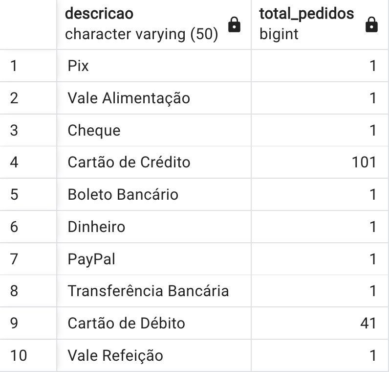

# Consultas Avançadas

Considerando o exemplo de pedido visto na aula anterior, vamos agora explorar consultas mais avançadas em SQL.
Lembrando que o modelo de dados é o seguinte:


Temos a tabela Cliente que se relaciona com a tabela Pedido. A tabela Pedido se relaciona com a tabela Item, que por sua vez gera uma tabela intermediária fruto da relação N-N com nome ItemPedido. O pedido também se relaciona com a tabela FormaPagamento. Neste modelo ainda temos os conceitos de Vendedor e Endereço.

Para que possamos explorar as consultas, vamos popular o banco de dados com alguns dados de exemplo. Um exemplo script para ajudar popular o banco de dados está disponível em [inserts.sql](lecture01/inserts.sql). Pode ser que esse script não seja suficiente para popular o banco de dados, então cada aluno deverá adaptar o script para que possa popular o banco de dados de acordo com sua necessidade.

Os comandos de inserção de dados servem para auxiliar na visualização dos dados. Como os IDs são gerenciados pelo próprio PgAdmin, não é necessário se preocupar com a ordem de inserção dos dados, no entanto as relações podem não conter os mesmos Ids e gerar problema. Cada aluno deverá procurar a melhor maneira de inserir os dados, de acordo com sua necessidade. Perceba que a função proposta para inserir vários *itens_pedido* de uma vez é uma maneira de facilitar a inserção de dados, mas não é a única maneira de se fazer isso. A função serve apenas para auxiliar a geração. Caso cada aluno decida inserir os dados de outra maneira, fique à vontade.

## Consultas em Join

Para realizar consultas em SQL, é necessário entender como as tabelas estão relacionadas. No exemplo do pedido, temos as seguintes relações:

- ```Cliente -> Pedido```
- ```Pedido -> ItemPedido --> Item```
- ```Pedido -> FormaPagamento```
- ```Pedido -> Vendedor```
- ```Cliente -> Endereço```

Para realizar consultas que envolvem mais de uma tabela, é necessário realizar um JOIN entre as tabelas. O JOIN é uma operação que combina linhas de duas ou mais tabelas com base em uma coluna relacionada entre elas.

Por exemplo, na relação ```Cliente -> Pedido```, podemos realizar um JOIN para obter os pedidos de um cliente específico. 

```sql
SELECT * FROM cliente
JOIN pedido ON cliente.id = pedido.cliente_id
WHERE cliente.id = 1;
```

Perceba que existe um filtro na cláusula **WHERE** para que possamos obter os pedidos de um cliente específico. Como também exites um filtro na cláusula **JOIN** para que possamos relacionar as tabelas. Esse filtro é feito através da relação entre as tabelas, que é feita através da chave estrangeira. As chaves estrangeiras são utilizadas para relacionar as tabelas e garantir a integridade referencial. Neste caso específico a chave estrangeira é o campo ```cliente_id``` da tabela ```Pedido```.

Considerando a relação ```Pedido -> FormaPagamento```, podemos realizar um JOIN para obter a forma de pagamento de um pedido específico.

```sql
SELECT * FROM pedido
JOIN forma_pagamento ON pedido.forma_pagamento_id = forma_pagamento.id
WHERE pedido.id = 1;
```

Esta consulta irá retornar a forma de pagamento do pedido com id 1.

No entanto se eu quiser um relatório com todos os pedidos cujo a formas de pagamento for realizada por Cartão de Crédito, posso fazer o seguinte:

```sql
SELECT * FROM pedido
JOIN forma_pagamento ON pedido.forma_pagamento_id = forma_pagamento.id
WHERE forma_pagamento.descricao = 'Cartão de Crédito';
```

Ainda se for necessário obter um relatório com todos os pedidos (com a quantidade de cada pedido), agrupado por forma de pagamento, podemos fazer o seguinte:

```sql
SELECT formas_pagamento.descricao, count(pedidos.id) as total_pedidos FROM pedidos
JOIN formas_pagamento ON pedidos.forma_pagamento_id = formas_pagamento.id
GROUP BY formas_pagamento.descricao;
```



Considerando a relação ```Pedido -> ItensPedido -> Itens```, podemos realizar um JOIN para obter diversos tipos de informação. Por exemplo, se eu quiser obter todos os itens de um pedido específico, posso fazer o seguinte:

```sql
SELECT * FROM pedido
JOIN itens_pedido ON pedido.id = itens_pedido.pedido_id
JOIN itens ON itens_pedido.item_id = itens.id
WHERE pedido.id = 1;
```

Se eu quiser obter o valor total de um pedido, posso fazer o seguinte:

```sql
SELECT sum(itens.valor) as total FROM pedido
JOIN itens_pedido ON pedido.id = itens_pedido.pedido_id
JOIN itens ON itens_pedido.item_id = itens.id
WHERE pedido.id = 1;
```

Perceba que nestes 2 exemplos acima são necessários 2 **JOIN** pois estamos relacionando 3 tabelas. vale sempre lembrar que o **JOIN** é feito através da chave estrangeira, que é a relação entre as tabelas.

Considerando a relação ```Pedido -> Vendedor```, podemos realizar um JOIN para obter o vendedor de um pedido específico.

```sql
SELECT * FROM pedido
JOIN vendedor ON pedido.vendedor_id = vendedor.id
WHERE pedido.id = 1;
```

Podemos também verificar os pedidos de um vendedor específico:

```sql
SELECT * FROM pedido
JOIN vendedor ON pedido.vendedor_id = vendedor.id
WHERE vendedor.id = 1;
```

Ou ainda verificar o total de vendas des vendedores:

```sql
SELECT vendedores.nome, count(pedidos.id) as total_pedidos FROM pedidos
JOIN vendedores ON pedidos.vendedor_id = vendedores.id
GROUP BY vendedores.nome
```

Considerando a relação ```Cliente -> Endereço```, podemos realizar um JOIN para obter o endereço de um cliente específico.

```sql
SELECT * FROM cliente
JOIN endereco ON cliente.endereco_id = endereco.id
WHERE cliente.id = 1;
```

A relação que temos como a mais importante é a relação entre ```Cliente --> Pedido -> ItensPedido -> Itens```. Essas 4 tabelas estão relacionadas e podemos fazer consultas que envolvem todas elas. Por exemplo, se eu quiser obter o valor total de todos os pedidos de um cliente específico, posso fazer o seguinte:

```sql
SELECT sum(itens.valor) as total FROM cliente
JOIN pedido ON cliente.id = pedido.cliente_id
JOIN itens_pedido ON pedido.id = itens_pedido.pedido_id
JOIN itens ON itens_pedido.item_id = itens.id
WHERE cliente.id = 1;
```

Perceba que temos 3 **JOIN** para relacionar as tabelas. A relação é feita através da chave estrangeira, que é a relação entre as tabelas. Neste caso específico a chave estrangeira é o campo ```cliente_id``` da tabela ```Pedido```. Na relação entre ```Pedido -> ItensPedido``` a chave estrangeira é o campo ```pedido_id``` da tabela ```ItensPedido```. E na relação entre ```ItensPedido -> Itens``` a chave estrangeira é o campo ```item_id``` da tabela ```Itens```. Preste atenção que cada **JOIN** relaciona a tabela corrente mais a próxima tabela que será relacionada.

Se quisermos obter o valor total de todos os pedidos de um cliente específico, agrupado por forma de pagamento, posso fazer o seguinte:

```sql
SELECT formas_pagamento.descricao, sum(itens.valor) as total FROM cliente
JOIN pedido ON cliente.id = pedido.cliente_id
JOIN itens_pedido ON pedido.id = itens_pedido.pedido_id
JOIN itens ON itens_pedido.item_id = itens.id
JOIN formas_pagamento ON pedido.forma_pagamento_id = formas_pagamento.id
WHERE cliente.id = 1
GROUP BY formas_pagamento.descricao;
```

## GRUPO BY, SUM, COUNT, HAVING, ORDER BY

Esta consulta é um pouco mais complexa, pois envolve 4 **JOIN** e um **GROUP BY**. O **GROUP BY** é utilizado para agrupar os resultados por forma de pagamento. O **SUM** é utilizado para somar o valor dos itens de cada pedido. Este tipo de consulta é muito comum em sistemas de vendas, onde é necessário obter o valor total de vendas por forma de pagamento, ou ainda um total de vendar por venderor.

A cláusula **WHERE** é utilizada para filtrar os resultados. A clausula **GROUP BY** é utilizada para agrupar os resultados. A clausula **SUM** é utilizada para somar os valores. A clausula **COUNT** é utilizada para contar os valores.

Temos ainda a cláusula **HAVING**. A cláusula **HAVING** é utilizada para filtrar os resultados de um GROUP BY. Por exemplo, se eu quiser obter o valor total de todos os pedidos de um cliente específico, agrupado por forma de pagamento, mas quero apenas as formas de pagamento que tiveram mais de 1 pedido, posso fazer o seguinte:

```sql
SELECT formas_pagamento.descricao, sum(itens.valor) as total FROM cliente
JOIN pedido ON cliente.id = pedido.cliente_id
JOIN itens_pedido ON pedido.id = itens_pedido.pedido_id
JOIN itens ON itens_pedido.item_id = itens.id
JOIN formas_pagamento ON pedido.forma_pagamento_id = formas_pagamento.id
WHERE cliente.id = 1
GROUP BY formas_pagamento.descricao
HAVING count(pedido.id) > 1;
```

Perceba que a cláusula **HAVING** é utilizada para filtrar os resultados do **GROUP BY**. Neste caso, estamos filtrando as formas de pagamento que tiveram mais de 1 pedido. São retornadas apenas as formas de pagamento que tiveram mais de 1 pedido. Só existe **HAVING** quando existe **GROUP BY**.

Algo semelhante acontece entre as cláusulas ON e WHERE. Como saber separar o uso destas 2 cláusulas? A cláusula **ON** é utilizada para relacionar as tabelas, ou seja, para fazer o JOIN. A cláusula **WHERE** é utilizada para filtrar os resultados. A cláusula **HAVING** é utilizada para filtrar os resultados de um **GROUP BY**.

Esse tipo de diferença é essencial na manipulação de consultas SQL. Muitos tem dificuldade em entender a diferença entre essas cláusulas, mas é essencial para a manipulação de dados.

Outra Cláusula essencial é a **ORDER BY**. A cláusula **ORDER BY** é utilizada para ordenar os resultados. Por exemplo, se eu quiser obter o valor total de todos os pedidos de um cliente específico, agrupado por forma de pagamento, mas quero ordenar os resultados por valor total, posso fazer o seguinte:

```sql
SELECT formas_pagamento.descricao, sum(itens.valor) as total FROM cliente
JOIN pedido ON cliente.id = pedido.cliente_id
JOIN itens_pedido ON pedido.id = itens_pedido.pedido_id
JOIN itens ON itens_pedido.item_id = itens.id
JOIN formas_pagamento ON pedido.forma_pagamento_id = formas_pagamento.id
WHERE cliente.id = 1
GROUP BY formas_pagamento.descricao
HAVING count(pedido.id) > 1
ORDER BY total;
```

 A cláusula **ORDER BY** pode ser utilizada para ordenar os resultados de forma crescente ou decrescente. Por padrão, a ordenação é feita de forma crescente. Para ordenar de forma decrescente, é necessário utilizar a palavra chave **DESC**. Por exemplo, se eu quiser ordenar os resultados de forma decrescente, posso fazer o seguinte:

```sql
SELECT formas_pagamento.descricao, sum(itens.valor) as total FROM cliente
JOIN pedido ON cliente.id = pedido.cliente_id
JOIN itens_pedido ON pedido.id = itens_pedido.pedido_id
JOIN itens ON itens_pedido.item_id = itens.id
JOIN formas_pagamento ON pedido.forma_pagamento_id = formas_pagamento.id
WHERE cliente.id = 1
GROUP BY formas_pagamento.descricao
HAVING count(pedido.id) > 1
ORDER BY total DESC;
```

A cláusula **ORDER BY** pode ser usada em consultas simples sem **JOIN** para classificar o resultado em ordem crescente ou decrescente.

Para ordenar contatos por nome:

```sql
SELECT * FROM clientes ORDER BY nome;
```

Para ordenar clientes por nome em ordem alfabética:

```sql  
SELECT * FROM clientes ORDER BY nome ASC;
```

Para ordenar clientes por numero de pedidos, em ordem decrescente:

```sql
SELECT clientes.nome, count(pedidos.id) as total_pedidos FROM clientes
JOIN pedidos ON clientes.id = pedidos.cliente_id
GROUP BY clientes.nome
ORDER BY total_pedidos DESC;
```

## Valores Distintos

A cláusula DISTINCT é usada para retornar apenas valores distintos para os pedidos.

Para obter uma lista de formas de pagamento distintas:
  
  ```sql
  SELECT DISTINCT descricao FROM formas_pagamento;
  ```

Para obter uma lista de vendedores distintos:
  
  ```sql
  SELECT DISTINCT nome FROM vendedores;
  ```

Para obter uma lista de clientes distintos:
  
  ```sql
  SELECT DISTINCT nome FROM clientes;
  ```

## Intervalos de Busca

A cláusula BETWEEN é usada para selecionar valores dentro de um intervalo. A cláusula BETWEEN é inclusiva: os valores de início e fim são incluídos no intervalo.

Para obter uma lista de pedidos entre 1 e 10:
  
  ```sql
  SELECT * FROM pedidos WHERE id BETWEEN 1 AND 10;
  ```

Para obter uma lista de pedidos entre 1 e 10, ordenados por numero de itens por pedido:

  ```sql
  SELECT pedidos.id, count(itens_pedido.id) as total_itens FROM pedidos
  JOIN itens_pedido ON pedidos.id = itens_pedido.pedido_id
  WHERE pedidos.id BETWEEN 1 AND 10
  GROUP BY pedidos.id
  ORDER BY total_itens;
  ```

## Consultas com Subconsultas

Uma subconsulta é uma consulta aninhada dentro de outra consulta SQL. As subconsultas são usadas para retornar dados que serão usados na consulta principal como um valor de filtro.

Considerando apenas 2 tabelas podemos ter a seguinte subconsulta:

```sql
SELECT * FROM pedidos WHERE cliente_id IN (SELECT id FROM clientes WHERE nome = 'João');
```

Neste exemplo, a subconsulta é utilizada para obter o id do cliente com nome 'João'. A subconsulta é utilizada como um filtro para a consulta principal. 

Considerando a relação ```Pedido -> FormaPagamento```, podemos realizar uma subconsulta para obter os pedidos de um cliente específico. 
  
  ```sql
  SELECT * FROM pedido
  JOIN forma_pagamento ON pedido.forma_pagamento_id = forma_pagamento.id
  WHERE pedido.cliente_id IN (SELECT id FROM cliente WHERE nome = 'João');
  ```

Considerando subconsultas um pouco mais complexas, podemos obter o valor total de todos os pedidos de um cliente específico, agrupado por forma de pagamento, mas quero apenas as formas de pagamento que tiveram mais de 1 pedido, posso fazer o seguinte:

```sql
SELECT formas_pagamento.descricao, sum(itens.valor) as total FROM cliente
JOIN pedido ON cliente.id = pedido.cliente_id
JOIN itens_pedido ON pedido.id = itens_pedido.pedido_id
JOIN itens ON itens_pedido.item_id = itens.id
JOIN formas_pagamento ON pedido.forma_pagamento_id = formas_pagamento.id
WHERE cliente.id = 1
AND formas_pagamento.id IN (SELECT formas_pagamento.id FROM pedidos
JOIN formas_pagamento ON pedidos.forma_pagamento_id = formas_pagamento.id
GROUP BY formas_pagamento.id
HAVING count(pedidos.id) > 1)
GROUP BY formas_pagamento.descricao;
```

Neste exemplo, a subconsulta é utilizada para obter as formas de pagamento que tiveram mais de 1 pedido. A subconsulta é utilizada como um filtro para a consulta principal. A subconsulta é utilizada para obter os valores que serão utilizados na consulta principal.

Considerando uma subconsulta mais simples, podemos obter o valor total de todos os pedidos de um cliente específico, agrupado por forma de pagamento, mas quero apenas as formas de pagamento que tiveram mais de 1 pedido, posso fazer o seguinte:

```sql
SELECT formas_pagamento.descricao, sum(itens.valor) as total FROM cliente
JOIN pedido ON cliente.id = pedido.cliente_id
JOIN itens_pedido ON pedido.id = itens_pedido.pedido_id
JOIN itens ON itens_pedido.item_id = itens.id
JOIN formas_pagamento ON pedido.forma_pagamento_id = formas_pagamento.id
WHERE cliente.id = 1
AND formas_pagamento.id IN (1, 2)
GROUP BY formas_pagamento.descricao;
```

É importante entender que as subconsultas é uma ferramenta poderosa para manipular dados em SQL. As subconsultas são utilizadas para retornar dados que serão utilizados na consulta principal como um valor de filtro. É um tipo de consulta aninhada dentro de outra consulta SQL. Um filtro específico pode ser aplicado a uma subconsulta para retornar um conjunto de dados específico.
  
## Conclusão

Nesta aula, vimos como filtrar, ordenar e agrupar dados em consultas SQL. 

Essas consultas cobrem uma ampla gama de operações avançadas em PostgreSQL. Com essas técnicas, você pode gerenciar e consultar sua agenda de contatos de maneira eficiente e eficaz. Se precisar de mais detalhes ou tiver outras perguntas, estou aqui para ajudar!
