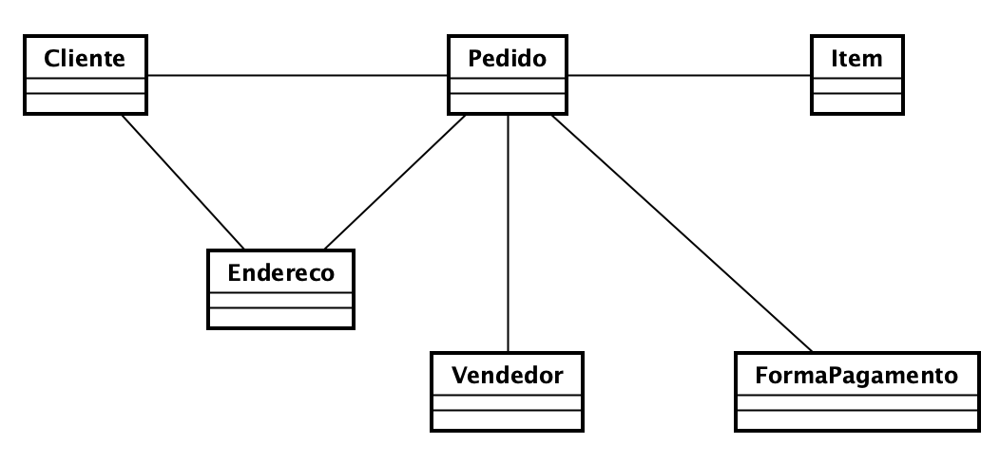

## TP - Trabalho Prático 2

### Objetivo

Praticar Programação de Acesso a Banco de Dados a partir do modelo de dados da aula anterior.


### Descrição

- O trabalho pode ser feito em grupos de até 2 pessoas.
- O trabalho deve ser enviado via github-classroom.
- O trabalho deve ser feito em Python.
- Os membros do grupo devem enviar (*commit e push*), cada um, pelo menos a metade das questões abaixo.
- O link para o Assignment é: [Assignment TP2](https://classroom.github.com/a/9c6LpSCE)
- Os códigos devem ser implementados em arquivos separados e com a estrutura definida à seguir.
- O prazo de entrega é até o dia 29/10/2024 até às 12:00.
- O nome das equipes deem ser: `tp2-nomeSobrenome-nomeSobrenome`.
- Não seguir alguma das regras na descrição desta atividade implicará em não correção da atividade.

### Atividade

A partir do modelo de dados abaixo, implemente um programa em python que acesso o banco de dados em PostgreSQL e realize as consultas vistas no [TP1](https://github.com/placidoneto/pa-bd-lecture/blob/lecture00-modelando-dados/tp1.md) e executadas no pgAdmin. O objetivo é que o programa faça as consultas e exiba o resultado na tela. 
O modelo de dados a ser considerado é o mesmo do TP1:



Considere que para acessar o banco de dados a partir de um programa em Python, você deve utilizar a biblioteca psycopg2. Abaixo está um exemplo de como acessar o banco de dados e manipular as funções. Você deve adaptar o código abaixo, mantendo o conceito de Menu para acessar as opções para fazer as consultas solicitadas. Abaixo está um exemplo de como acessar o banco de dados e manipular as funções.

```python
import psycopg2
from psycopg2 import sql

# Função para conectar ao banco de dados PostgreSQL
def connect():
    try:
        conn = psycopg2.connect(
            dbname="seu_banco_de_dados",
            user="seu_usuario",
            password="sua_senha",
            host="seu_host",
            port="sua_porta"
        )
        return conn
    except Exception as e:
        print(f"Erro ao conectar ao banco de dados: {e}")
        return None

# Função para inserir dados na tabela
def inserir_dados(conn, nome, idade):
    try:
        with conn.cursor() as cursor:
            cursor.execute("""
                INSERT INTO exemplo (nome, idade) VALUES (%s, %s)
            """, (nome, idade))
            conn.commit()
            print("Dados inseridos com sucesso.")
    except Exception as e:
        print(f"Erro ao inserir dados: {e}")

# Função para ler dados da tabela
def selecionar_dados(conn):
    try:
        with conn.cursor() as cursor:
            cursor.execute("SELECT * FROM exemplo")
            rows = cursor.fetchall()
            for row in rows:
                print(row)
    except Exception as e:
        print(f"Erro ao ler dados: {e}")

# Função para atualizar dados na tabela
def atualizar_dados(conn, id, nome, idade):
    try:
        with conn.cursor() as cursor:
            cursor.execute("""
                UPDATE exemplo SET nome = %s, idade = %s WHERE id = %s
            """, (nome, idade, id))
            conn.commit()
            print("Dados atualizados com sucesso.")
    except Exception as e:
        print(f"Erro ao atualizar dados: {e}")

# Função para deletar dados da tabela
def deletar_dados(conn, id):
    try:
        with conn.cursor() as cursor:
            cursor.execute("DELETE FROM exemplo WHERE id = %s", (id,))
            conn.commit()
            print("Dados deletados com sucesso.")
    except Exception as e:
        print(f"Erro ao deletar dados: {e}")

# Exemplo de uso das funções
if __name__ == "__main__":

    while(True):
        #Menu com funções
        print("1 - Inserir dados")
        print("2 - Selecionar dados")
        print("3 - Atualizar dados")
        print("4 - Deletar dados")
        print("5 - Sair")
        opcao = int(input("Digite a opção desejada: "))
        if opcao == 1:
            nome = input("Digite o nome: ")
            idade = int(input("Digite a idade: "))
            conn = connect()
            if conn:
                inserir_dados(conn, nome, idade)
                conn.close()
        elif opcao == 2:
            conn = connect()
            if conn:
                selecionar_dados(conn)
                conn.close()
        elif opcao == 3:
            id = int(input("Digite o id: "))
            nome = input("Digite o nome: ")
            idade = int(input("Digite a idade: "))
            conn = connect()
            if conn:
                atualizar_dados(conn, id, nome, idade)
                conn.close()
        elif opcao == 4:
            id = int(input("Digite o id: "))
            conn = connect()
            if conn:
                deletar_dados(conn, id)
                conn.close()
        elif opcao == 5:
            break
        else:
            print("Opção inválida")

```

Considere também criar classes de modelo para representar as entidades do banco de dados. Por exemplo, você pode criar uma classe Cliente, Pedido, ItemPedido, etc. 

### Estrutura de Arquivos

```
tp2-nomeSobrenome-nomeSobrenome
│   README.md
│   main.py
│   /conexao
│       conexao.py
|   /modelos
│       cliente.py
│       pedido.py
│       item_pedido.py
│       vendedor.py
│       forma_pagamento.py
│       item.py
│       endereco.py
```

As funções de consulta devem ser implementadas na classe ```main.py```. As classes de modelo devem ser implementadas em arquivos separados na pasta modelos. A classe de conexão deve ser implementada na pasta ```conexao```. A classe ```main.py``` deve importar as classes de modelo e a classe de conexão. As ```classes de modelo``` são classes de dados apenas, sem métodos para manipulação de dados. A classe de conexão deve ter métodos para conectar ao banco de dados e executar as consultas. 
A classe main.py deve ter um menu para acessar as opções de consulta. Cada opção do menu deve chamar um método da classe de conexão para executar a consulta. Os métodos da classe de conexão devem retornar os resultados das consultas para a classe main.py, que deve exibir os resultados na tela. A classe de ```conexao``` utilizara os modelos para representar os dados, como como parâmetros de entrada de dados, seja como resultados de saída.

### Consultas
1. **Listar todos os pedidos feitos por um cliente específico**

2. **Listar todos os itens de um pedido específico**

3. **Listar todos os clientes que fizeram pedidos em um determinado intervalo de datas**
   
4. **Listar todos os pedidos e os respectivos clientes**

5. **Listar todos os itens vendidos por um vendedor específico**

6. **Listar todos os pagamentos feitos em um determinado intervalo de datas**

7. **Listar todos os pedidos que foram pagos com uma forma de pagamento específica**

8. **Listar todos os clientes e seus respectivos endereços**
   
9. **Listar todos os vendedores que venderam itens em um determinado intervalo de datas**
   
10. **Listar todos os itens que estão fora de estoque**
   

